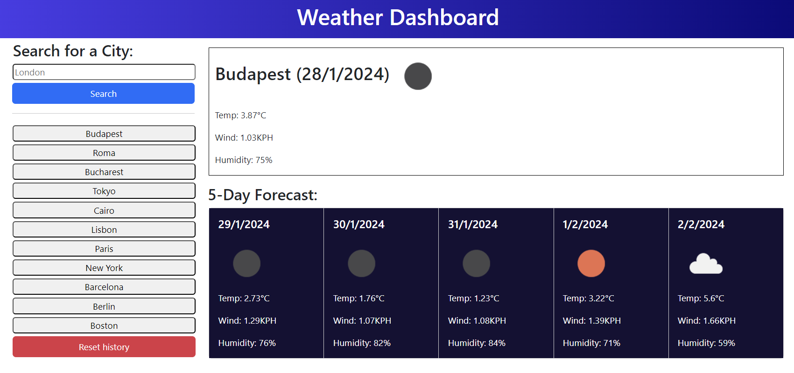

# Weather-Dashboard-CristianB

Weather Dashboard App - part of Bootcamp challenge

## Description

This Project was created for bootcamp challenge.

It tests the knowledge gained in HTML, CSS, JavaScript, JQuery, Dayjs and API during the last weeks, especially the implementation of API. It takes the user input and is using API to fetch weather data from https://openweathermap.org/ . It is displaying the temperature, humidity and wind speed for the current day and the forecast weather for next 5 days. The searched city is displayed bellow the search box and the display history persist if the page is refreshed.

This is how it looks:

## Installation

The repository is on the GitHub repositories public domain https://github.com/docbogdanc/Weather-Dashboard-CristianB.git and the deployed webpage can be found at https://docbogdanc.github.io/Weather-Dashboard-CristianB/ where it was deployed using GitHub

## Usage

The code is free to be used according to the licence condition (please see the licence file from the GitHub repository)

## Credits

- Bootcamp EDX ( a big cheers for bootcamp teachers! ) provided the needed **materials**, the most wanted **inspiration** and the difficult to obtain **motivation**  

  
- Bootstrap - used for card group model

- Dayjs

        https://day.js.org/en/

- JQuery

        https://cdnjs.com/libraries/jquery/3.2.1

- Open weather website

        https://openweathermap.org/

        

- Xpert Learning Assistant - the Bootcamp Course AI, used for helping with some of the javascript syntax
 
         https://bootcampspot.instructure.com/courses

- Markdown Guide used for styling the readme.md

         https://www.markdownguide.org/basic-syntax/

## License

MIT license

